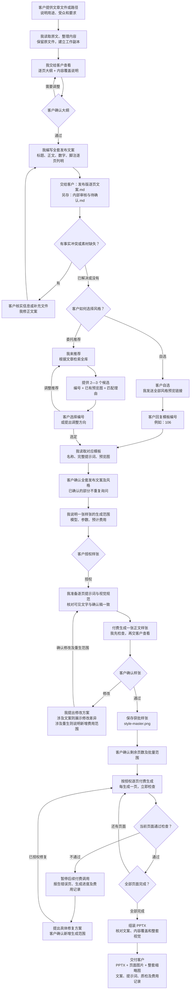

# 超云 PPT Skill 人机交互流程

本流程适用于商业发布 PPT，说明客户参与节点、助手处理步骤，以及双方交互的文件。具体执行规则见 [SKILL.md](SKILL.md) 和 [商业发布文案审核与付费门禁](references/publication-copy-gate.md)。

选风格、大纲确认、文案确认、样张确认分别有效，不能互相替代。已确认的内容不重复询问。

## 人机交互流程图

客户自选时发送 [全部 PPT 风格预览](https://xcn5phmhnu1z.feishu.cn/share/base/view/shrcnveXqYYHOnI8tcUJqkOckxc)，只需回复编号。如果客户一开始就给了编号，直接沿用，不必等到文案完成才选。

## 文件交互

| 阶段 | 客户提供或查看 | 我保存和使用的文件 |
|---|---|---|
| 提交资料 | 文章 Markdown、Word、PDF、截图、参考图片 | 原始资料工作副本、提取文本；不改原文件 |
| 确认内容结构 | 逐页大纲、内容覆盖说明 | 大纲、内容覆盖矩阵 |
| 审核发布文字 | 《发布版逐页文案.md》；核实必要问题 | 《内部审核与待确认.md》单独保存，不作为页面可见文字输入 |
| 选择风格 | 预览链接或候选预览图；回复编号 | 全库索引、对应模板完整提示词、预览图 |
| 确认样张 | 一张真实正文样张图片 | 逐页提示词、视觉规范、获批 style-master.png |
| 批量制作 | 正常情况下无需逐页确认；出错才处理 | 页面图片、检查结果、《付费生成记录.md》 |
| 最终交付 | PPTX、页面图片、缩略图及配套文档 | 构建清单、最终质检记录 |

## 付费和异常处理

- 第一次付费发生在整套文案确认之后；批量付费发生在样张通过、批量范围获批之后。
- 正常页面由我逐页检查，不需要客户每页确认。
- 未获当前生成范围授权时停留在该节点，不继续付费调用。
- 费用没有可靠依据时明确说明无法确认，不编造金额；被中断调用的计费情况不明时记录“计费状态未知”。
- 修改已确认的对外文案时，先展示差异并取得确认；内部审稿话语不能进入成品页面。
- 错误页暂停后续付费调用。若已有明确包含重试的预算及范围，在其范围内执行；否则先确认具体修复方案与新增生成数量。
- 整套质检不通过时先修复并复检，涉及额外付费时仍按授权范围执行。未完成检查的文件标为审核稿，不声称可直接商业发布。
